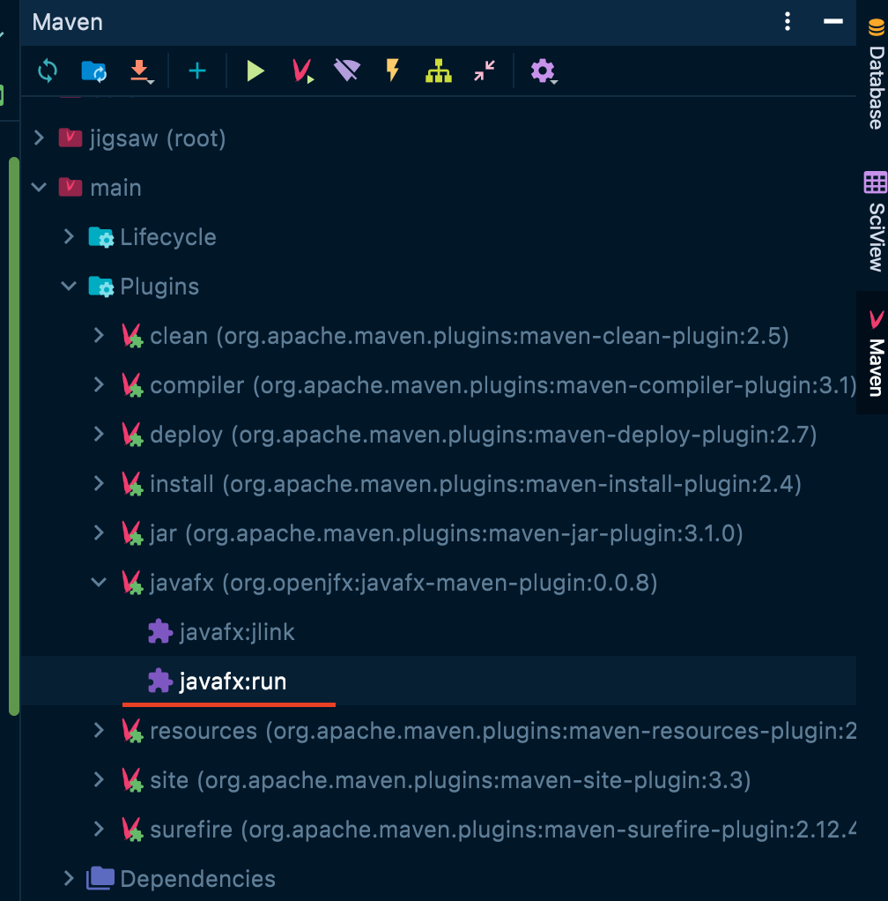

# Jigsaw

## Features:

## Structure:

## How to run:

You can run using idea:
 1. Open Maven
 2. Open main module
 3. Open Plugins
 4. Open javafx and run `javafx:run`
 

Or you can run nex command:

`mvn clean install -pl Main javafx:run`

#### Created and powered by Matvey Popov.
#### Test coverage 77%