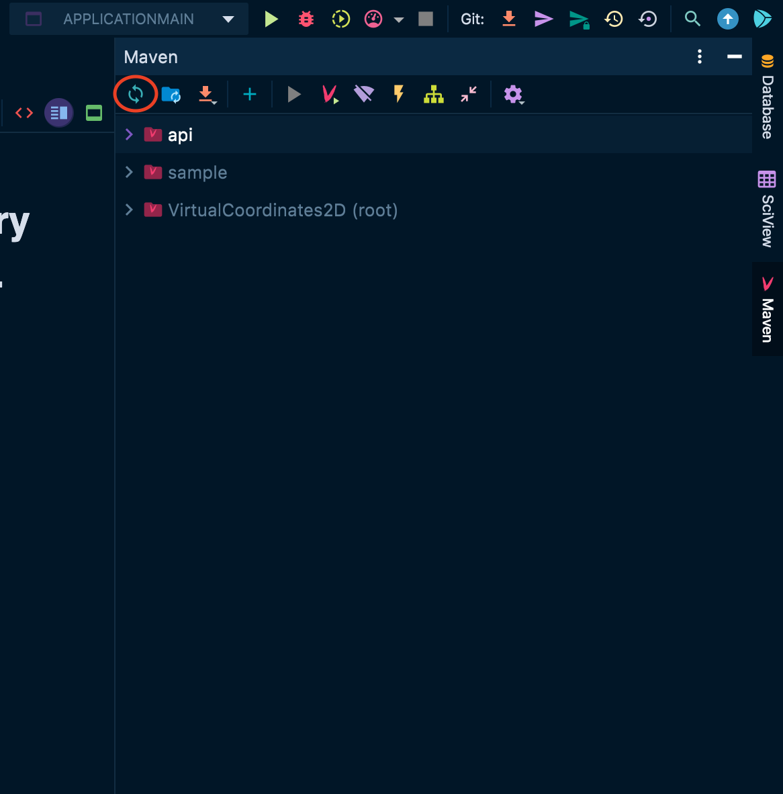
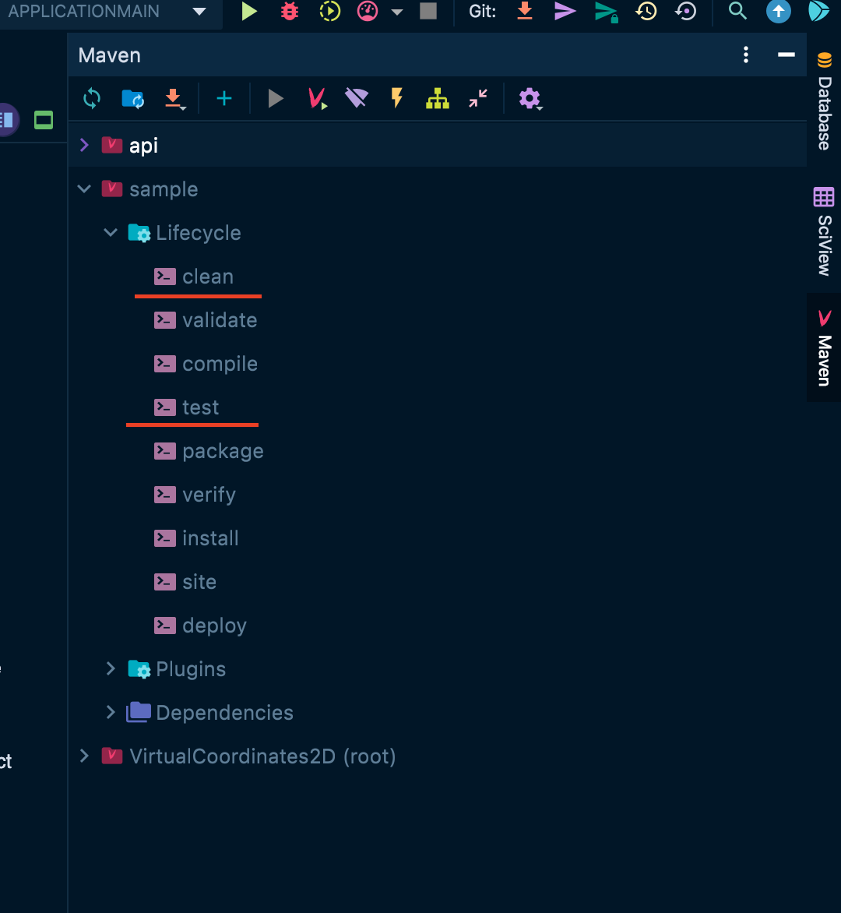
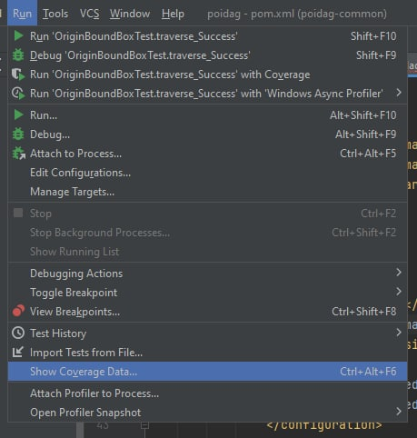
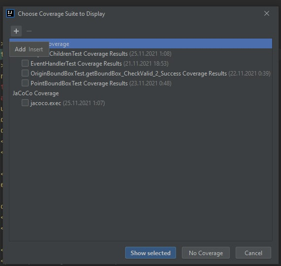
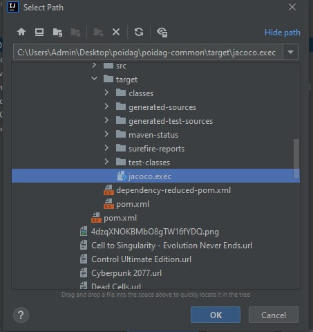
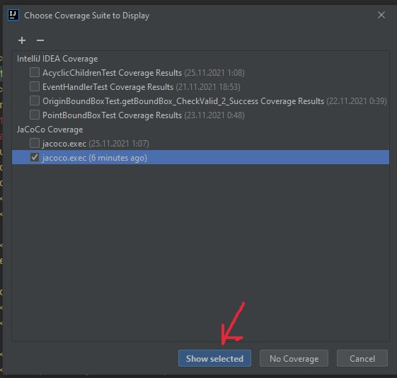
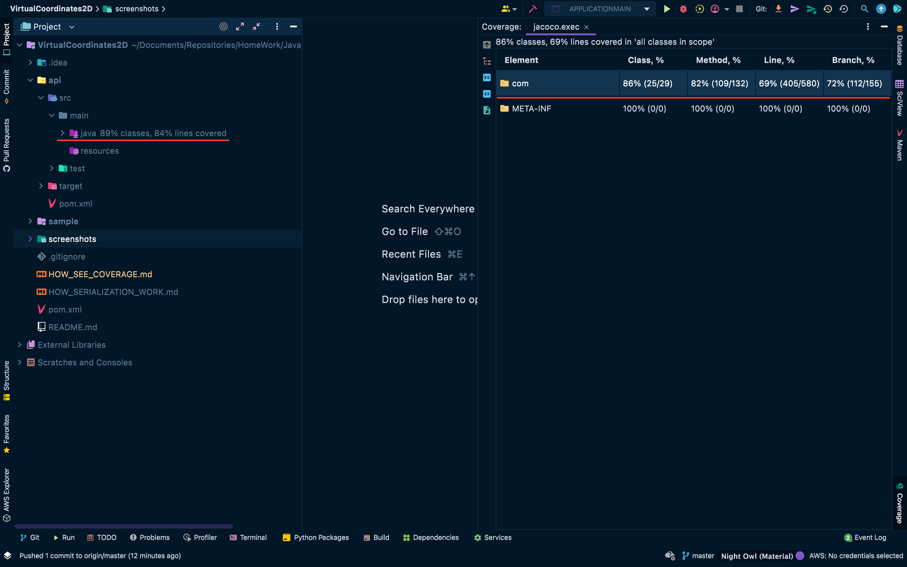

# How see library test coverage.

## Steps:
## 1. Reload all maven projects.

## 2. Launch `clean` task and then `test`.

## 3. Open Idea tab `Run` -> `Show coverage data...`.
   
## 4. Click `Add` button.
   
## 5. Select generated `jacoco.exe` file in `target` folder.

## 6. Click `Show selected`.

## 7. Congratulations! Now you can reflect on the tests.
